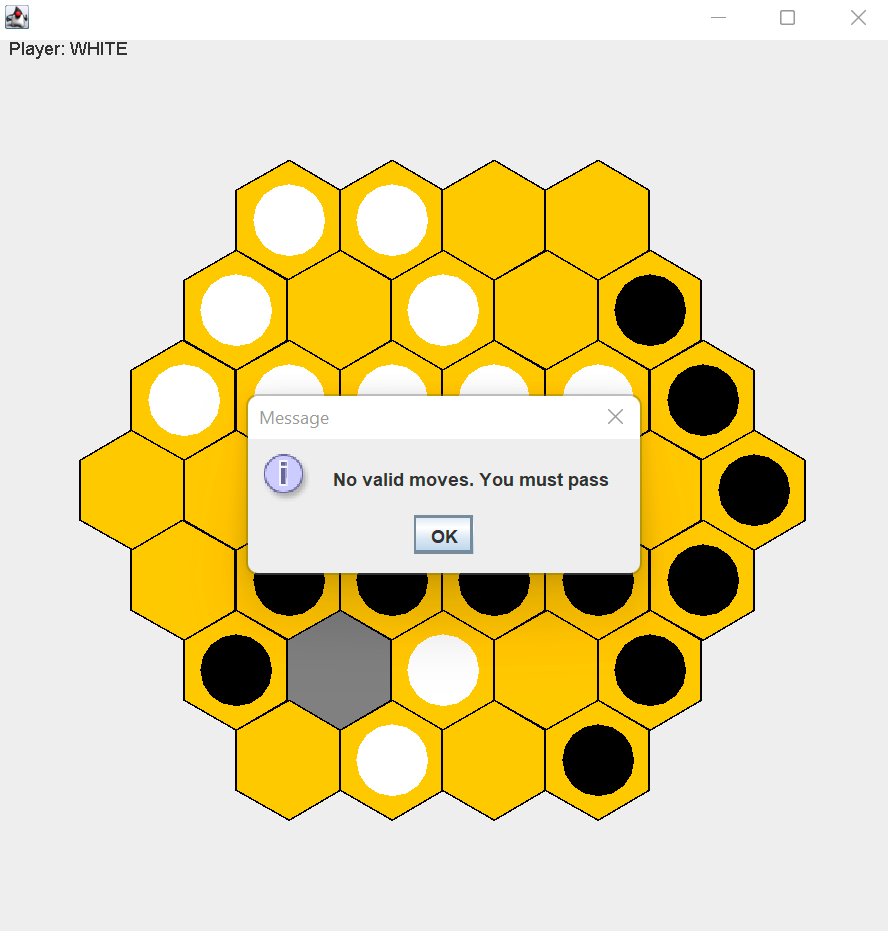
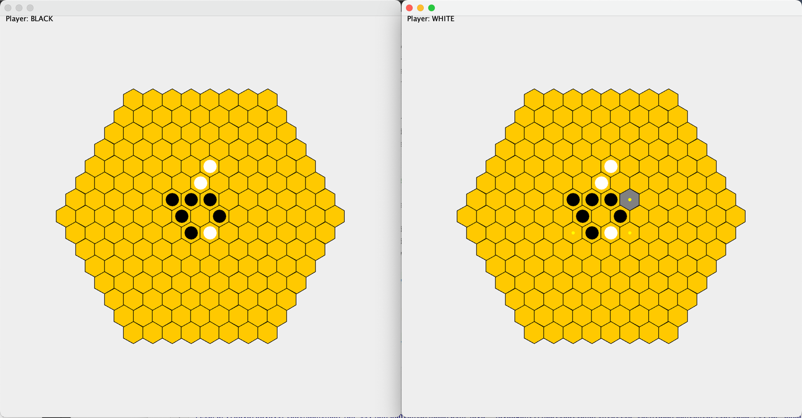
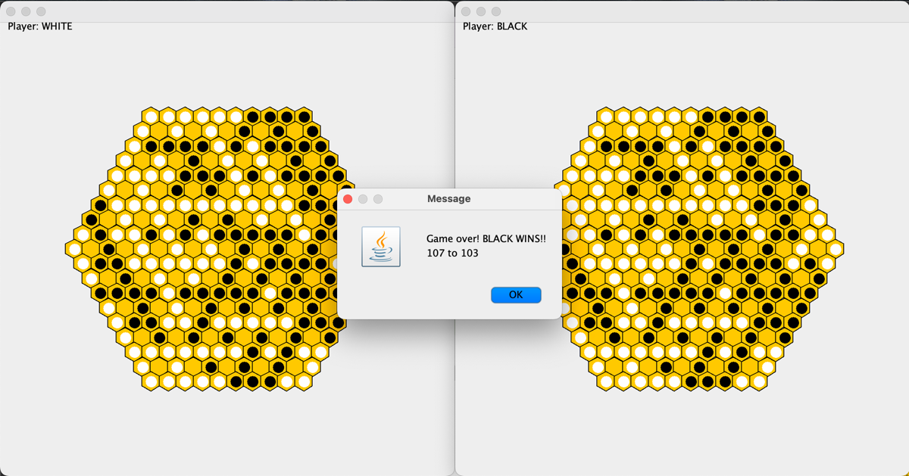

# CS3500 Hexagonal Reversi

## Overview

This codebase is designed to implement the full game of
reversi on a hexagonal board. The game consists of two players
competing for control of a board. The game is turn based,
and whenever a player manages to 'sandwich' another players pieces
it captures all the pieces in between and turns them into the player's
piece color.

A turn can optionally be passed, or forced to pass if there are no
available moves. The game is over either when a both players skip in a row
or there are no more available moves. The player with more pieces
on the board when the game ends is the winner.

The game assumes that the player understands the player interface
and knows how to make moves, and does the rest from there.

### Extensibility
- The game is implemented due to the MVC design pattern, consisting of a model,
  view, and controller.
- Currently, the only implementation of the view is a textual version,
  where the entire game is represented in the terminal. In the future,
  we plan to implement our interface with a graphical user interface, to be more
  friendly.
- It's within our bounds to extend any of the three sections of
  our design, to create a different type of reversi, a different
  view for reversi, and various types of controllers, being human or ai.
-  At this time, no controllers are implemented

***
### Why Reversi?
- It was due
- The game looked fun to play
***

### HexPosition

There are three coordinates, with the central coordinate is (q,r,s) = (0,0,0). 
In any given direction, two coordinates change while one stays the same.
The corresponding coordinate increases in each direction are:

         q,-r,+s    +q,-r,s
               \   /
                \ /
      -q,r,+s ---*--- +q,r,-s
                / \
               /   \
         -q,+r,s     q,+r,-s
    
     q
      /    \
     |  *  | r
      \    /
      s

The coordinates cannot just be any number, and it is ALWAYS true that:

    q = -r - s; // ( q + r + s will equal 0 )

For a more in depth understanding of how to work our game,
please observe the model's interface ReversiModel for additional methods with javadoc.

---

## Hierarchy

### Key Components

#### Model

As stated, we strictly followed the model-view-controller design
pattern. Quickly, the model is the one that models the entire game board, handling
moves, which piece is where, what is legal, as well as making changes when commands are inputted.

#### View
Our GUI view represents the Hex Reversi Board as a GUI that can be interacted with. When moves are 
made, it notifies its observer (the controller) that a move was made so that the controller can 
update the model accordingly. The GUI allows for clicking, and when it is not your current turn, the
view disables clicking. When it is your turn, the view displays possible moves as a small yellow 
indicator. The view displays messages that are helpful to the user (such as when it's your turn, 
when the game ends when you must pass). The view only displays messages if the user is not an AI.

#### Controller
The controller acts as a intermediary between the view and the model. To do this, the controller
acts as an observer to two different sets of features (defined in our features interfaces). It first
observes for any model changes, such as the board updating, or whose turn it is, which is then
passed to the view. It also observers for any moves made, which can be done by the Players 
(in the case of an AI player), or by the view (in the case of a human player). For moves, the
controller processes player and view moves identically.

### Key Subcomponents
Our main subcomponents, besides being our implementations of our interfaces for the explained
hexagonal version of reversi as well as the view, would be our classes for the hexagonal positions
as well as teamcolor.

#### HexPosition
This was explained briefly earlier, but essentially this class just has its three coordinates,
and mainly checks to make sure that the position is legal. It additionally has the basic toString,
getters, as well as equals and hashcode.

#### TeamColor
TeamColor is our enumerated type for representing every team playing the game, as well as
their desired textual representation. It also contains the information about cycling through the 
teams: if it is one colors turn, who goes next?

### Source Organization
Our codebase is first split into source and tests. Tests is just for our
testing to make sure every single thing works as we intend it to.
If you choose source, follow this map to be guided.

                        Source
                          |
                          |
                    cs3500.reversi ---------------------------------
                    /     |                                          \
                   /      |                                           \
              model   controller                                      view 
                 /     |                                               /
                /      |  ModelFeatures, PlayerFeatures (interfaces)  /    
               /       |         \           /                       /
              |   HexReversiController (interface)                  /                    
              |                         \                          /     JFrame       JPanel
              |                          \                 IReversiView   /             |
          ReversiModel (interface)       |                        |      /              |
              |                          |                ReversiGUIView (has a JReversiPanel)
              |                          |     
              |                  VisualController (has a Player (interface))   
              |                                             /     \
              |                                       HumanPlayer  \  
              |                                                     \ 
    HexPosition (hexagonal implementation of ReversiModel)           \
             /                             \              AIPlayer (has a strategy (interface)
            /                               \                                           |
           /                                 \                                      ChooseMost
    HexPosition (hex coords)          TeamColor (enum of possible types)

# Changelog

## Changes to PART I

- added additional observer methods
    - getBoard, flipCount, getWhiteScore, getBlackScore
- deprecated textualView classes
- abstracted toFlip methods and improved logic in HexReversi
- added documentation improvements
- fixed TeamColor accessibility
    - private field

## Additions for PART II
- added GUIView
- added strategies interface and implementations
    - userInput, captureMost
- added player interface and implementation
- added tests for new methods and classes
- added mock HexReversi class for testing
- possible valid moves are highlighted by tiny dot in gui

## Changes to PART II
- Changed the model to add observers 
- Changed the player interface to better distinct between AI and humans
- Deprecated the usertextinput strategy, as it is no longer in use

## Additions for PART III
- Added features interfaces and implementations for both the model and the view
- Created mocks for the controller and view to test
- Create a controller, which is an observer in model and view. 
  - There is a controller and a view for each player.

# GUI Interaction Tutorial
When the GUI is open and in focus, the following behavior is implemented:
To resize the view, drag and resize the frame. The GUI will scale accordingly. To click on a cell,
click with the mouse cursor on a cell. The cell coordinates will be printed in the system console.
To make a move, select a cell and press enter. The move made will be printed in the system console.
To pass, press p. An indicator will be printed in the system console. Possible valid moves for the
current turn are highlighted by the tiny yellow sot.

# How To Play HEXREVERSI
Run the jar with the commandline arguments to determine 
the size of the board (equal to the radius of the board) as well as two arguments to pick whether 
you want a HUMAN or AI for each respective player. For example, if you wanted a game of size 5,
where a human was player 1 and an ai was player 2, run

    java -jar reversi.jar 5 human ai

in the terminal.

Two windows will pop up, one for each respective player. Available moves are 
highlighted by the small dot. If you are incapable of playing a move, the 
game will tell you so and force you to pass. 

Below is a given example of what the game should look like
early into gameplay. 

When the game is over, the game will make a popup telling
who whe winner is as well as the score. 

# Part IV: Code Swap

## What we got working

We, due to the great work of our providers, were actually able to get all of the functionality
requested by the assignment to work. The second view will now always be our providers view, and
our commandline now supports the following operations to play with their strategies:

    java -jar reversi.jar SIZE ____ ____

The size is the size of the board in reference to the radius of the hexagons.
The blanks spots can be filled with the keywords "human", "strategy1", "providerstrategy1", 
"providerstrategy2", and finally "providerstrategy3" to play with the respective strategies and 
players. 

# Part V: Extra Credit
In the extra credit, we removed all the changes from the code swap. 
We added the ability to add hints in the game every when 'h' is pressed on the keyboard. When a 
cell is highlighted, when hint mode is on, it will display the number of flips that move will make.

We also added all the functionality of SQUARE reversi. To play, the commandline now looks like the 
following:

    java -jar reversi.jar SIZE human/ai human/ai hex/square

where 'hex'/'square' is the type of board you want to play on. Everything you loved 
about the original reversi is preserved, with the ability to control the gui against the ai.

### nota bene
for the ta, we abstracted hexreversi to abstractreversi, and added the class
squarereversi to represent the new game. we also added a new decorator class
for the hints. we implemented all the extra credit features, and didn't
have to touch our controller or strategies. we also added interface position
and implementations hexposition and squareposition. thanks!

# Finale

This project has been a great fun, and we hope you enjoy it as much as we did making it.

# References

Most of our knowledge about the hexagonal coordinate system
was based off this incredibly useful article, please check it out
if you have time because it gets into stuff way more
interesting than reversi.

    https://www.redblobgames.com/grids/hexagons/

We additionally used this site to learn how to play this game, which implements
hexagonal reversi with an AI incredibly hard to beat.

    http://meta-site.net/hexlo0.1/#